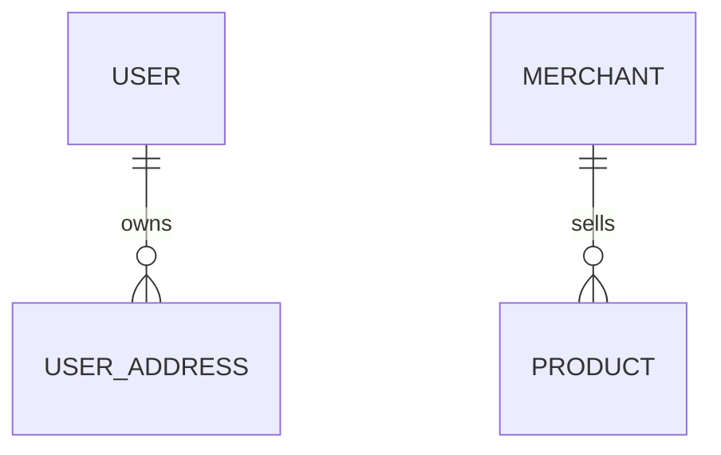

# 数据库 ER 图（Mermaid）

## 文件位置

- 单一文件：`wiki/database/er-diagram.md`。
- 文件开头用一级标题说明：「数据库 ER 图（自动生成/人工维护）」及最后同步日期。

## 语法

使用 Mermaid 的 `erDiagram`：

## 同步规则

1. **表级**：每有一张表在迁移或实体中出现，对应 **一个 `ENTITY` 名称**（建议与表名一致，如 `USER` 对应表 `user`）。
2. **关系**：用 `||--o{` / `}o--||` 等表达一对多、多对一；在注释中标注外键字段名。
3. **字段**：在 ER 图中可只列 **主键、外键、高频查询字段**；完整字段以 `tables.md` 为准。
4. **变更流程**：表结构变更后，先更新迁移与实体，再 **同一提交或紧随提交** 更新 `er-diagram.md`。

## 语法约束（避免渲染失败）

- **实体名**：使用 `PascalCase` 或全大写单词，避免空格与特殊符号。
- **关系标签**：简短英文或中文，避免未转义的双引号冲突。
- 若表名/字段名含保留含义，使用 `ENTITY_NAME` 形式，在文内说明与真实表名的映射。

## 大库拆分（可选）

表数量过多时，可拆分为：

- `wiki/database/er-diagram-core.md`（用户/订单核心域）
- `wiki/database/er-diagram-support.md`（营销/配置等）

并在 `er-diagram.md` 中只做索引与总览图。
