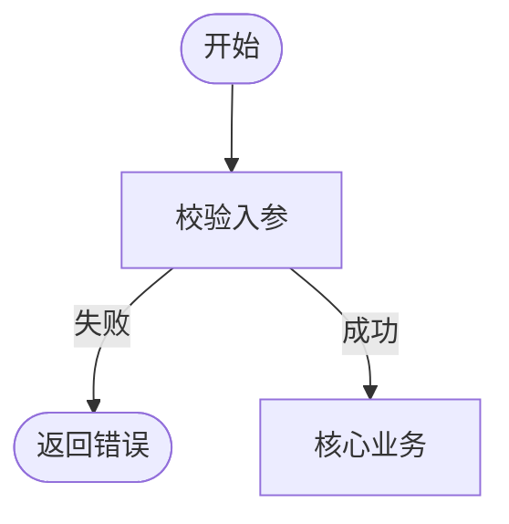

# 功能业务逻辑流程图（Mermaid）

## 文件位置

- 每个功能独立文件：`wiki/features/<module>/<feature-slug>.md`。
- 文件内至少包含：
  - **功能名称**、**涉及角色**（用户/系统/第三方）
  - **前置条件**、**后置结果**
  - **一张主流程图**（`flowchart` 或 `sequenceDiagram`）

## 推荐图表类型

| 场景 | 推荐 |
|------|------|
| 多分支、状态机 | `flowchart TD` |
| 强调调用顺序与系统边界 | `sequenceDiagram` |
| 与 Kafka/异步相关 | 流程图中单独标出「异步消息」节点 |

## 同步规则

1. **Service/Controller 逻辑变更** 时，必须检查对应功能页中的流程图是否仍正确。
2. 新增分支（如新增失败补偿）时，在图中增加节点或子图，并在文内用编号步骤说明。
3. 与项目 `design.md` 或业务技能中的流程描述 **语义一致**（若存在）。

## Mermaid 约束

- 节点 ID 使用 **camelCase** 或 **PascalCase**，避免空格。
- 节点标签含括号、逗号等特殊字符时，使用双引号包裹标签文本。
- 避免使用 `end` 作为节点 ID（与 subgraph 冲突）。
- 流程图仅描述 **业务语义**，不要把每一行代码都画进图里。

## 示例（写入功能页时）

在 `wiki/features/<module>/<feature>.md` 中可直接使用：

