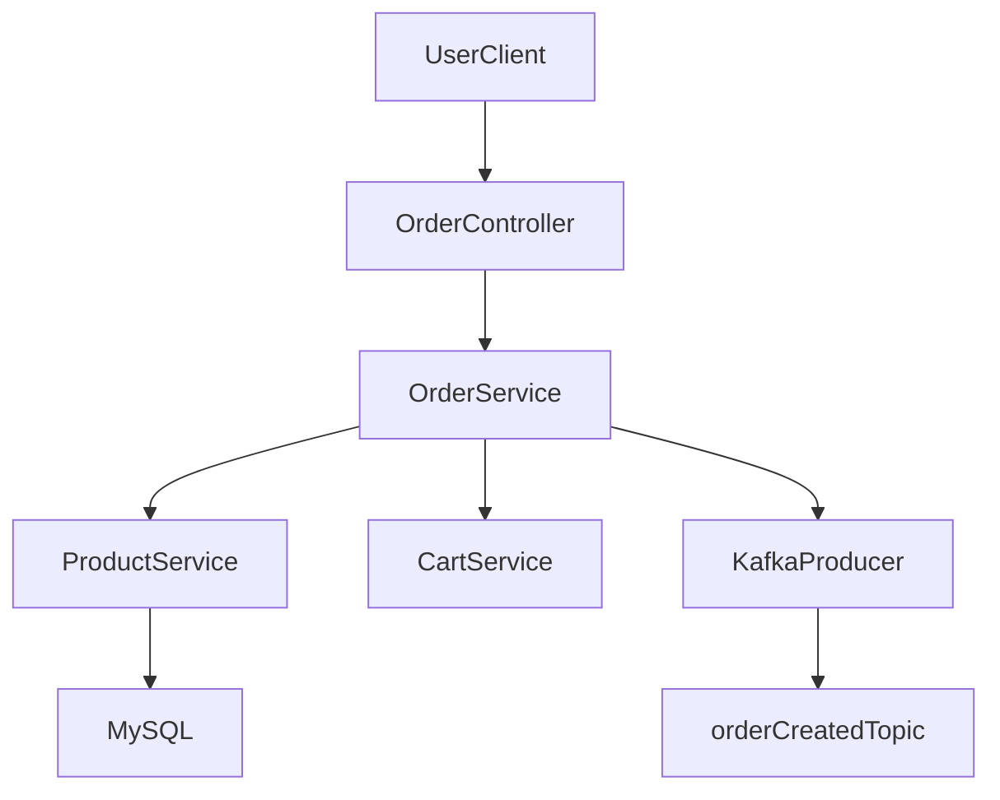
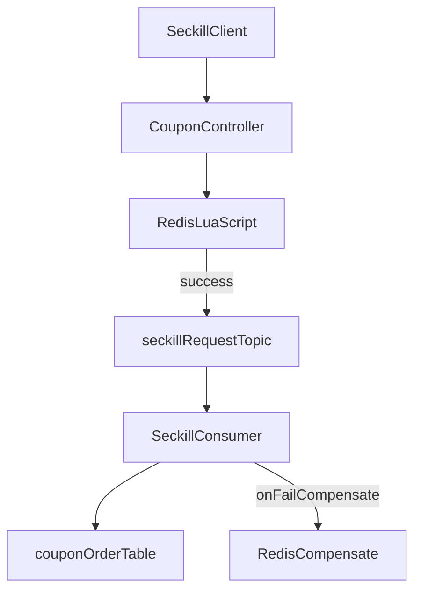
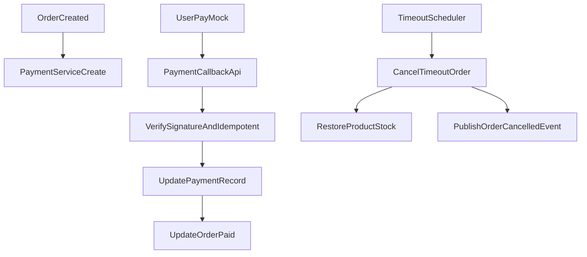

# 1. 系统整体架构设计

## 1.1 前后端架构图（文字描述）

系统采用前后端分离 + 分层后端架构：

1. 用户通过 Web/H5 访问 Vue3 前端应用。
2. 前端通过 Axios 调用 Spring Boot 提供的 RESTful API，JWT 放在请求头中。
3. 后端按 Controller -> Service -> Domain/Repository（MyBatis-Plus Mapper）分层处理业务。
4. 核心交易数据落 MySQL，热点读和高并发控制走 Redis。
5. 订单异步处理、秒杀削峰、状态补偿通过 Kafka 完成。
6. 支付模块通过模拟支付网关回调订单服务，更新支付状态并触发后续流程。

可抽象为：

- Client（Vue3）  
  -> API Gateway（可选 Nginx + 反向代理）  
  -> Spring Boot（Controller/Service）  
  -> MySQL（事务数据）  
  -> Redis（缓存/库存/锁）  
  -> Kafka（异步事件总线）

## 1.2 技术选型说明

- 前端：`Vue3 + TypeScript + Vite + Axios + Pinia`
  - Vue3 组合式 API 适合复杂业务拆分。
  - TypeScript 提高 API 契约与可维护性。
  - Vite 启动快、构建效率高。
  - Axios 方便统一拦截器（JWT、错误处理、重试）。
  - Pinia 轻量且与 Vue3 深度契合。
- 后端：`Spring Boot + MyBatis-Plus + MySQL + Redis + Kafka`
  - Spring Boot：快速构建可测试、可扩展服务。
  - MyBatis-Plus：降低 CRUD 样板代码，便于分页与条件构造。
  - MySQL：保障订单、支付等交易一致性。
  - Redis：支撑高并发下的低延迟读写和原子控制。
  - Kafka：用于异步下单、秒杀削峰、状态通知。

## 1.3 各组件职责

- `MySQL`
  - 保存用户、商品、订单、支付、优惠券主数据。
  - 通过事务确保订单创建、库存扣减、支付状态变更一致性。
- `Redis`
  - 缓存商家/商品详情，降低数据库压力。
  - 存储购物车临时态（用户维度）。
  - 秒杀库存预扣、资格标记（一人一单）、请求幂等令牌。
  - 实现分布式锁（商品库存热点竞争场景）。
- `Kafka`
  - 秒杀请求异步化，削峰填谷。
  - 下单后异步任务（发券、通知、统计埋点）。
  - 支付成功/失败事件广播，解耦订单状态更新与其他消费者。

# 2. 项目目录结构

## 2.1 后端（Spring Boot）

建议单体模块化（后续可拆微服务）的目录结构：

```text
backend/
  pom.xml
  src/main/java/com/food/delivery/
    DeliveryApplication.java      # Spring Boot 启动类
    common/
      constant/                  # 常量定义（状态码、缓存 key 前缀）
      enums/                     # 通用枚举
      exception/                 # 业务异常、全局异常处理
      response/                  # 统一返回体 Result<T>
      util/                      # 工具类（时间、金额、签名等）
      log/                       # AOP 日志、链路追踪封装
    config/
      MybatisPlusConfig.java     # MP 分页、审计字段、逻辑删除
      RedisConfig.java           # RedisTemplate/序列化配置
      KafkaConfig.java           # Producer/Consumer 基础配置
      SecurityConfig.java        # Spring Security + JWT
    infrastructure/
      redis/
        RedisKeyManager.java      # Redis key 规范
        LuaScriptExecutor.java    # Lua 脚本执行封装
      kafka/
        producer/
        consumer/
        event/                    # 事件模型（order.created 等）
      security/
        JwtTokenProvider.java
        JwtAuthenticationFilter.java
    controller/
      user/
      merchant/
      product/
      cart/
      order/
      coupon/
      payment/
    service/
      user/
      merchant/
      product/
      cart/
      order/
      coupon/
      payment/
    impl/
      user/
      merchant/
      product/
      cart/
      order/
      coupon/
      payment/
    mapper/
      user/
      merchant/
      product/
      cart/
      order/
      coupon/
      payment/
    entity/
      user/
      merchant/
      product/
      cart/
      order/
      coupon/
      payment/
    dto/
      user/
      merchant/
      product/
      cart/
      order/
      coupon/
      payment/
    vo/
      user/
      merchant/
      product/
      cart/
      order/
      coupon/
      payment/
    convert/
      user/                       # DTO/Entity/VO 转换
      merchant/
      product/
      cart/
      order/
      coupon/
      payment/
  src/main/resources/
    mapper/                      # MyBatis XML（按模块分目录）
      user/
      merchant/
      product/
      cart/
      order/
      coupon/
      payment/
    db/migration/                # DDL 变更脚本（Flyway/Liquibase）
    application.yml
    application-dev.yml
    application-prod.yml
    logback-spring.xml
  src/test/java/com/food/delivery/
    module/
      user/
      order/
      product/
```

目录职责说明：

- `DeliveryApplication`：启动入口，保证组件扫描根包统一。
- `config`：Spring Boot 配置类集中管理（安全、Redis、Kafka、MyBatis-Plus）。
- `controller/service/mapper/entity/dto/vo/convert`：按技术分层做外层目录，每层内再按业务模块分包。
- `service` 与 `impl`：接口层与实现层分离，便于测试替换和后续扩展。
- `entity/dto/vo/convert`：持久化模型、入参模型、出参模型解耦，避免对象混用。
- `infrastructure`：中间件能力封装，业务层只依赖抽象能力。

## 2.2 前端（Vue3）

```text
frontend/
  src/
    api/                      # 按模块拆分请求（user.ts/order.ts/...）
    assets/                   # 静态资源
    components/               # 通用组件（商品卡片、数量选择器、地址弹窗）
    composables/              # 复用逻辑（useAuth、useCart、useCountdown）
    router/                   # 路由与权限守卫
    store/                    # Pinia 状态仓库（auth/cart/order）
    types/                    # TS 类型声明（DTO、VO、枚举）
    utils/                    # 工具（request 封装、金额计算、节流防抖）
    views/
      auth/                   # 登录/注册页
      home/                   # 商家列表、搜索
      merchant/               # 商家详情、商品分类
      cart/                   # 购物车
      order/                  # 下单、订单列表、订单详情
      coupon/                 # 秒杀券页面
      payment/                # 支付结果页
    App.vue
    main.ts
```

按业务模块划分关系：

- `api + store + views` 形成闭环：用户操作 -> 状态更新 -> 接口调用 -> UI 响应。
- 与后端模块对应：`user/order/product/cart/coupon/payment` 一一映射，降低沟通成本。

# 3. 数据库设计（核心）

说明：字符集 `utf8mb4`，引擎 `InnoDB`，主键统一 `bigint`（雪花或号段），金额字段使用 `decimal(10,2)`。

## 3.1 用户与认证

### `user`

| 字段 | 类型 | 约束 | 说明 |
|---|---|---|---|
| id | bigint | PK | 用户ID |
| mobile | varchar(20) | unique, not null | 手机号 |
| password_hash | varchar(128) | not null | 密码哈希 |
| nickname | varchar(64) |  | 昵称 |
| status | tinyint | not null default 1 | 1正常 0禁用 |
| created_at | datetime | not null | 创建时间 |
| updated_at | datetime | not null | 更新时间 |

索引：`uk_mobile(mobile)`。

### `user_address`

| 字段 | 类型 | 约束 | 说明 |
|---|---|---|---|
| id | bigint | PK | 地址ID |
| user_id | bigint | idx, not null | 用户ID |
| contact_name | varchar(64) | not null | 联系人 |
| contact_phone | varchar(20) | not null | 联系电话 |
| province | varchar(32) | not null | 省 |
| city | varchar(32) | not null | 市 |
| district | varchar(32) | not null | 区 |
| detail | varchar(255) | not null | 详细地址 |
| latitude | decimal(10,6) |  | 纬度 |
| longitude | decimal(10,6) |  | 经度 |
| is_default | tinyint | not null default 0 | 默认地址 |
| created_at | datetime | not null | 创建时间 |
| updated_at | datetime | not null | 更新时间 |

索引：`idx_user_id(user_id)`。

## 3.2 商家与商品

### `merchant`

| 字段 | 类型 | 约束 | 说明 |
|---|---|---|---|
| id | bigint | PK | 商家ID |
| name | varchar(128) | not null | 商家名称 |
| logo_url | varchar(255) |  | 商家logo |
| min_delivery_amount | decimal(10,2) | not null | 起送价 |
| delivery_fee | decimal(10,2) | not null | 配送费 |
| status | tinyint | not null default 1 | 1营业 0休息 |
| rating | decimal(3,2) | default 5.00 | 评分 |
| monthly_sales | int | default 0 | 月售 |
| created_at | datetime | not null | 创建时间 |
| updated_at | datetime | not null | 更新时间 |

索引：`idx_status(status)`。

### `product_category`

| 字段 | 类型 | 约束 | 说明 |
|---|---|---|---|
| id | bigint | PK | 分类ID |
| merchant_id | bigint | idx, not null | 商家ID |
| name | varchar(64) | not null | 分类名称 |
| sort | int | not null default 0 | 排序 |
| created_at | datetime | not null | 创建时间 |
| updated_at | datetime | not null | 更新时间 |

索引：`idx_merchant_sort(merchant_id, sort)`。

### `product`

| 字段 | 类型 | 约束 | 说明 |
|---|---|---|---|
| id | bigint | PK | 商品ID |
| merchant_id | bigint | idx, not null | 商家ID |
| category_id | bigint | idx, not null | 分类ID |
| name | varchar(128) | not null | 商品名 |
| description | varchar(512) |  | 商品描述 |
| price | decimal(10,2) | not null | 售价 |
| stock | int | not null default 0 | 库存 |
| sales | int | not null default 0 | 销量 |
| status | tinyint | not null default 1 | 1上架 0下架 |
| version | int | not null default 0 | 乐观锁版本号 |
| created_at | datetime | not null | 创建时间 |
| updated_at | datetime | not null | 更新时间 |

索引：`idx_merchant_status(merchant_id, status)`，`idx_category(category_id)`，`idx_name(name)`。

## 3.3 购物车

### `cart_item`

| 字段 | 类型 | 约束 | 说明 |
|---|---|---|---|
| id | bigint | PK | 购物车项ID |
| user_id | bigint | idx, not null | 用户ID |
| merchant_id | bigint | idx, not null | 商家ID |
| product_id | bigint | idx, not null | 商品ID |
| quantity | int | not null | 数量 |
| checked | tinyint | not null default 1 | 是否勾选 |
| unit_price_snapshot | decimal(10,2) | not null | 加购时单价快照 |
| created_at | datetime | not null | 创建时间 |
| updated_at | datetime | not null | 更新时间 |

唯一索引：`uk_user_product(user_id, product_id)`。

## 3.4 订单

### `order`

| 字段 | 类型 | 约束 | 说明 |
|---|---|---|---|
| id | bigint | PK | 订单ID |
| order_no | varchar(32) | unique, not null | 订单号 |
| user_id | bigint | idx, not null | 用户ID |
| merchant_id | bigint | idx, not null | 商家ID |
| address_id | bigint | not null | 收货地址ID |
| total_amount | decimal(10,2) | not null | 原始总额 |
| discount_amount | decimal(10,2) | not null default 0.00 | 优惠金额 |
| delivery_fee | decimal(10,2) | not null default 0.00 | 配送费 |
| pay_amount | decimal(10,2) | not null | 应付金额 |
| status | tinyint | idx, not null | 0待支付 1已支付 2已接单 3配送中 4已完成 5已取消 |
| cancel_reason | varchar(128) |  | 取消原因 |
| paid_at | datetime |  | 支付时间 |
| timeout_at | datetime | idx | 超时关闭时间 |
| created_at | datetime | not null | 创建时间 |
| updated_at | datetime | not null | 更新时间 |

索引：`uk_order_no(order_no)`，`idx_user_created(user_id, created_at)`，`idx_status_timeout(status, timeout_at)`。

### `order_item`

| 字段 | 类型 | 约束 | 说明 |
|---|---|---|---|
| id | bigint | PK | 订单项ID |
| order_id | bigint | idx, not null | 订单ID |
| product_id | bigint | not null | 商品ID |
| product_name | varchar(128) | not null | 下单时商品名快照 |
| unit_price | decimal(10,2) | not null | 下单时单价 |
| quantity | int | not null | 数量 |
| amount | decimal(10,2) | not null | 小计 |
| created_at | datetime | not null | 创建时间 |
| updated_at | datetime | not null | 更新时间 |

索引：`idx_order_id(order_id)`。

## 3.5 优惠券秒杀

### `coupon`

| 字段 | 类型 | 约束 | 说明 |
|---|---|---|---|
| id | bigint | PK | 券ID |
| name | varchar(128) | not null | 券名称 |
| type | tinyint | not null | 1满减 2折扣 |
| amount | decimal(10,2) | not null | 面额/折扣值 |
| threshold_amount | decimal(10,2) | default 0.00 | 使用门槛 |
| start_time | datetime | not null | 生效时间 |
| end_time | datetime | not null | 失效时间 |
| status | tinyint | not null default 1 | 1可用 0停用 |
| created_at | datetime | not null | 创建时间 |
| updated_at | datetime | not null | 更新时间 |

### `coupon_stock`

| 字段 | 类型 | 约束 | 说明 |
|---|---|---|---|
| coupon_id | bigint | PK | 券ID |
| total_stock | int | not null | 总库存 |
| available_stock | int | not null | 可用库存 |
| version | int | not null default 0 | 乐观锁版本 |
| updated_at | datetime | not null | 更新时间 |

### `coupon_order`

| 字段 | 类型 | 约束 | 说明 |
|---|---|---|---|
| id | bigint | PK | 记录ID |
| coupon_id | bigint | idx, not null | 券ID |
| user_id | bigint | idx, not null | 用户ID |
| order_id | bigint |  | 关联订单ID（可空） |
| status | tinyint | not null | 0占位 1成功 2失败 |
| created_at | datetime | not null | 创建时间 |
| updated_at | datetime | not null | 更新时间 |

唯一索引：`uk_coupon_user(coupon_id, user_id)`（一人一单）。

## 3.6 支付

### `payment_record`

| 字段 | 类型 | 约束 | 说明 |
|---|---|---|---|
| id | bigint | PK | 支付记录ID |
| order_id | bigint | idx, not null | 订单ID |
| pay_no | varchar(32) | unique, not null | 支付流水号 |
| channel | varchar(32) | not null | 支付渠道（mock） |
| amount | decimal(10,2) | not null | 支付金额 |
| status | tinyint | not null | 0待支付 1成功 2失败 |
| callback_payload | text |  | 回调报文 |
| paid_at | datetime |  | 支付成功时间 |
| created_at | datetime | not null | 创建时间 |
| updated_at | datetime | not null | 更新时间 |

索引：`uk_pay_no(pay_no)`，`idx_order_id(order_id)`。

# 4. API 设计

统一前缀：`/api/v1`  
认证方式：`Authorization: Bearer <jwt>`  
统一返回：

```json
{
  "code": 0,
  "message": "success",
  "data": {},
  "requestId": "trace-id",
  "timestamp": 1710000000000
}
```

## 4.1 用户与认证模块

- `POST /auth/register`
  - 参数：`mobile,password,nickname`
  - 返回：`userId`
- `POST /auth/login`
  - 参数：`mobile,password`
  - 返回：`token,expireAt,userInfo`
- `GET /users/me`
  - 返回：当前用户信息
- `GET /users/addresses`
  - 返回：地址列表
- `POST /users/addresses`
  - 参数：`contactName,contactPhone,province,city,district,detail,isDefault`
  - 返回：新增地址ID
- `PUT /users/addresses/{id}`
  - 参数：同新增
  - 返回：更新结果
- `DELETE /users/addresses/{id}`
  - 返回：删除结果

## 4.2 商家与商品模块

- `GET /merchants`
  - 参数：`keyword,pageNo,pageSize`
  - 返回：商家分页列表
- `GET /merchants/{merchantId}`
  - 返回：商家详情
- `GET /merchants/{merchantId}/categories`
  - 返回：分类列表
- `GET /merchants/{merchantId}/products`
  - 参数：`categoryId,keyword,pageNo,pageSize`
  - 返回：商品分页列表
- `GET /products/{productId}`
  - 返回：商品详情

## 4.3 购物车模块

- `GET /cart/items`
  - 返回：购物车明细 + 金额汇总
- `POST /cart/items`
  - 参数：`merchantId,productId,quantity`
  - 返回：购物车项ID
- `PUT /cart/items/{id}`
  - 参数：`quantity,checked`
  - 返回：更新后明细
- `DELETE /cart/items/{id}`
  - 返回：删除结果
- `POST /cart/clear`
  - 参数：`merchantId`
  - 返回：清空结果

## 4.4 订单模块

- `POST /orders/preview`
  - 参数：`merchantId,addressId,cartItemIds,couponId?`
  - 返回：试算结果（原价、优惠、配送费、应付）
- `POST /orders`
  - 参数：`merchantId,addressId,cartItemIds,remark,couponId?`
  - 返回：`orderId,orderNo,payAmount,timeoutAt`
- `GET /orders/{orderId}`
  - 返回：订单详情 + 订单项 + 状态流转信息
- `GET /orders`
  - 参数：`status,pageNo,pageSize`
  - 返回：订单分页
- `POST /orders/{orderId}/cancel`
  - 参数：`reason`
  - 返回：取消结果

## 4.5 优惠券秒杀模块

- `GET /coupons/seckill`
  - 返回：秒杀券列表（含剩余库存、倒计时）
- `POST /coupons/{couponId}/seckill`
  - 参数：`requestId`（幂等键）
  - 返回：`queueNo` 或 `couponOrderId`
- `GET /coupons/seckill/result`
  - 参数：`couponId`
  - 返回：`processing/success/fail` + 失败原因

## 4.6 支付模块

- `POST /payments/create`
  - 参数：`orderId,channel`
  - 返回：`payNo,payUrl(mock),expireAt`
- `POST /payments/mock-callback`
  - 参数：`payNo,status,paidAt,signature`
  - 返回：回调处理结果
- `GET /payments/{orderId}/status`
  - 返回：支付状态

## 4.7 公共模块

- `GET /health`
  - 返回：服务健康状态
- `GET /dicts/order-status`
  - 返回：订单状态字典

常见错误码约定：

- `0`：成功
- `40001`：参数错误
- `40003`：未认证或 token 无效
- `40404`：资源不存在
- `40901`：库存不足
- `40902`：重复下单/重复领取
- `50000`：系统内部错误

# 5. 核心业务流程（重点）

## 5.1 下单流程

1. 前端提交下单请求（地址、购物车项、可选优惠券）。
2. 订单服务校验用户、地址、商品状态与库存。
3. 重新拉取商品价格并试算金额，防止前端价格篡改。
4. 事务内创建 `order`、`order_item`，扣减商品库存（乐观锁）。
5. 清理对应购物车项（MySQL 或 Redis 购物车缓存）。
6. 发送 `order.created` Kafka 事件，用于后续通知与统计。
7. 返回订单号与支付超时时间。



## 5.2 秒杀流程（Redis + Lua + Kafka）

核心目标：高并发下保证库存正确、一人一单、快速响应。

1. 用户请求秒杀接口，携带 `requestId`（幂等键）。
2. 应用执行 Lua 脚本（原子）：
   - 判断库存是否 > 0
   - 判断用户是否已抢过（集合或位图）
   - 通过则库存减 1、写入用户标记、写入请求幂等标记
3. Lua 成功后，将秒杀消息投递 Kafka（`seckill.request`）。
4. 消费者串行或分区有序消费，落库 `coupon_order`，并最终确认状态。
5. 若落库失败，发补偿消息恢复 Redis 库存与用户标记。
6. 前端轮询结果接口，查询 `processing/success/fail`。



## 5.3 支付与订单超时取消流程

1. 下单成功后创建支付记录 `payment_record`，订单状态为待支付。
2. 用户完成模拟支付，支付网关回调 `payments/mock-callback`。
3. 支付服务验签 + 幂等处理（同一 `payNo` 多次回调仅处理一次）。
4. 更新支付状态为成功，并驱动订单状态改为已支付。
5. 超时任务扫描 `status=待支付 且 timeout_at < now` 的订单执行取消。
6. 取消后回补库存、关闭支付单并发送 `order.cancelled` 事件。



# 6. 关键技术实现

## 6.1 Redis 使用场景

- 缓存
  - 商家列表/详情、商品详情缓存，TTL 5~15 分钟随机过期。
  - Key 示例：`merchant:detail:{id}`、`product:detail:{id}`。
- 购物车
  - 热路径用 Redis Hash：`cart:{userId}`，字段为 `productId`，值为数量与勾选状态。
  - 下单后异步或同步回写 DB，保障最终一致性。
- 秒杀库存
  - `seckill:stock:{couponId}` 保存剩余库存。
  - `seckill:users:{couponId}` 保存已抢用户集合。
  - Lua 原子校验库存+资格，避免并发竞态。
- 分布式锁
  - 对极热点商品可加锁：`lock:stock:{productId}`，防止超高并发下短时抖动。

## 6.2 Kafka 使用场景

- 削峰填谷
  - 秒杀请求进入 `seckill.request`，消费端按分区处理，平滑写库压力。
- 异步下单后处理
  - 订单创建后发 `order.created`，消费者处理通知、积分、统计。
- 订单状态广播
  - 支付成功/订单取消发事件，其他模块按需订阅。

建议 Topic：

- `seckill.request`
- `order.created`
- `order.paid`
- `order.cancelled`

消费保障：

- 至少一次投递 + 消费者幂等（业务唯一键）；
- 失败重试 + 死信队列（DLQ）；
- 关键事件记录消费日志便于追踪。

## 6.3 防止超卖与少卖方案

- 超卖防护
  - Redis 预扣库存（快速失败）；
  - 数据库更新语句携带条件 `stock >= ?` + 乐观锁 `version`；
  - 扣减失败立即补偿 Redis 预扣。
- 少卖防护
  - 消费失败自动重试；
  - 异常补偿任务对比 Redis 与 DB 库存差异；
  - 定时修正库存并报警。

## 6.4 幂等性设计

- 请求幂等
  - 前端下单、秒杀、支付请求都携带 `requestId`。
  - Redis 保存短期幂等键：`idem:{bizType}:{requestId}`。
- 业务幂等
  - 唯一键约束：如 `coupon_order(coupon_id,user_id)`。
  - 支付回调按 `pay_no` 做幂等检查。
- 消费幂等
  - 维护消费记录表（`msg_id + consumer_group`）。
  - 重复消息直接 ACK，不重复执行业务。

# 7. 可扩展性与优化

## 7.1 高并发优化思路

- 读多写少场景前置缓存，减少 DB 压力。
- 秒杀核心链路短路径化（Lua 原子 + MQ 异步）。
- 热点数据隔离（热点商家/商品单独缓存分片）。
- 接口限流（令牌桶）与降级策略（返回排队中/稍后再试）。
- 慢查询治理与索引优化，关键 SQL 持续压测。

## 7.2 分库分表（简单说明）

- 触发条件
  - 订单表达到千万级，单表写入/查询明显退化。
- 拆分策略
  - 按 `user_id` 或 `order_no` 哈希分库分表；
  - 历史订单冷热分离（近 3 个月热表，历史归档）。
- 路由与一致性
  - 中间件或应用层路由；
  - 跨库事务尽量通过最终一致性事件实现。

## 7.3 缓存策略（穿透、击穿、雪崩）

- 缓存穿透
  - 布隆过滤器拦截非法 Key；
  - 空值缓存短 TTL（例如 60 秒）。
- 缓存击穿
  - 热点 Key 互斥锁重建；
  - 或逻辑过期 + 后台异步刷新。
- 缓存雪崩
  - TTL 加随机抖动；
  - 多级缓存（本地缓存 + Redis）；
  - 雪崩时触发限流与熔断，保护 DB。

---

该设计可直接作为开发基线：可据此拆分后端模块开发任务、前端页面任务、数据库 DDL 和联调 API 契约。
