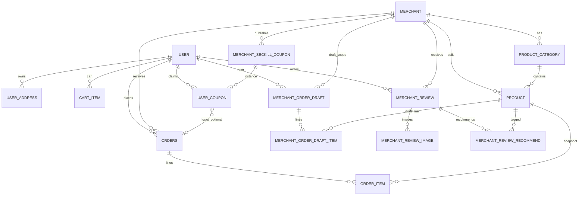

# 数据库 ER 图

> 与 Flyway 迁移 `V1`–`V17` 及实体类同步。完整字段见 [tables.md](tables.md)。

## Mermaid

## 迁移脚本索引

| 版本 | 主题 |
|------|------|
| V1 | 用户、收货地址 |
| V2–V6、V4 等 | 商家、分类、商品及演示数据 |
| V7 | 购物车 `cart_item` |
| V8 | 待下单草稿、订单、订单明细 |
| V9–V11 | 订单待支付/取消、订单号 |
| V12 | 订单商品小计、配送费 |
| V13 | 秒杀券模板、用户券 |
| V14 | 秒杀演示数据补充 |
| V15 | 商家距离、推荐权重（首页排序） |
| V16 | 商家评价、评价图、推荐菜 |
| V17 | 用户头像 `avatar_url` |
