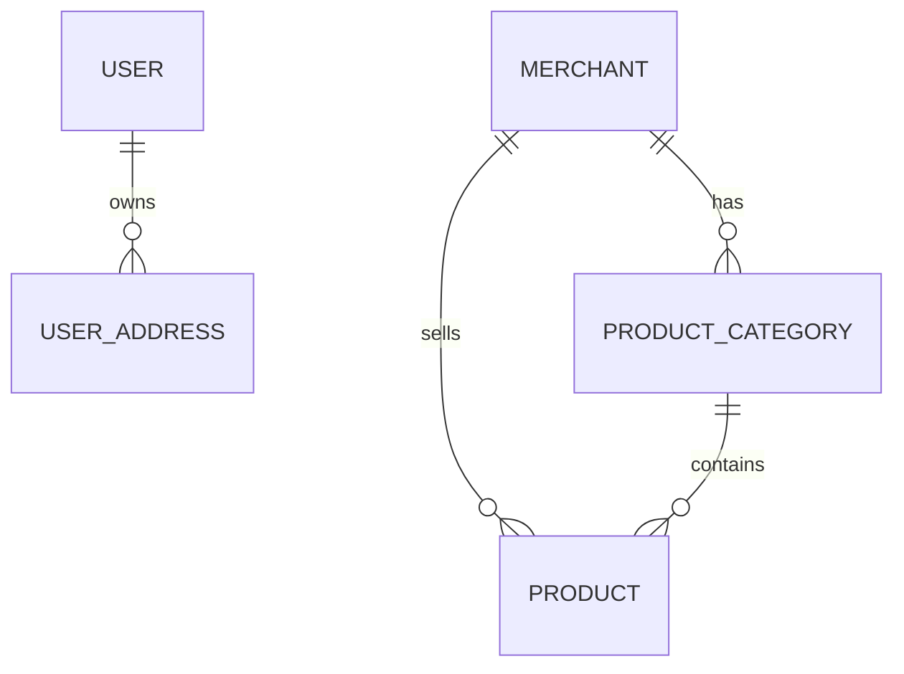

# 数据库 ER 图

> 占位说明：请在每次库表结构变更后更新本文件。

## 同步约定

- 以迁移脚本和实体类为准同步 ER 关系。
- 仅在图中展示核心关系，完整字段见 `tables.md`。

## Mermaid（当前已落地表）

> 说明：用户域见 `V1__create_user_and_address.sql`；商家与商品见 `V2__merchant_product.sql`。
