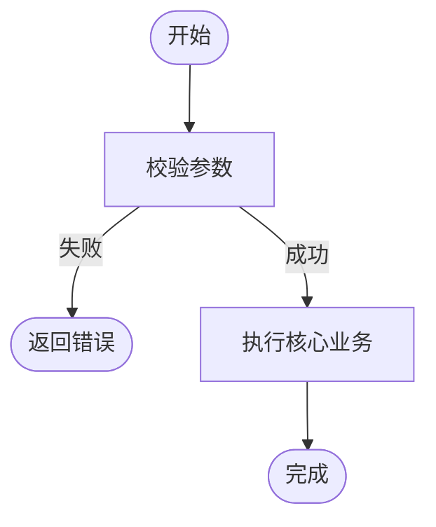

# 功能流程文档

> 占位说明：按模块创建子目录并维护每个功能的业务流程图。

## 约定

- 路径：`wiki/features/<module>/<feature>.md`
- 每个功能文档至少包含：
  - 功能目标
  - 前置条件
  - Mermaid 流程图
  - 异常分支说明

## 示例（占位）

```mermaid
flowchart TD
  Start([开始]) --> Validate[校验参数]
  Validate -->|失败| Fail([返回错误])
  Validate -->|成功| Biz[执行核心业务]
  Biz --> End([完成])
```
