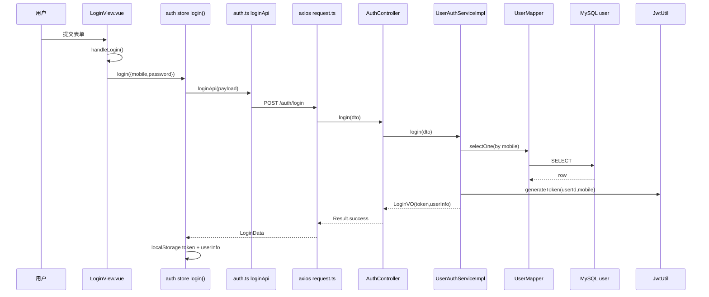

# 登录 / 注册 / 重置密码（全链路）

**Redis / Kafka**：未使用。数据：**MySQL `user` 表**。

## 1. 登录

### 前端

| 步骤 | 位置 | 函数 / 行为 |
|------|------|-------------|
| 用户提交表单 | `frontend/src/views/auth/LoginView.vue` | `@submit.prevent` → `handleLogin()` |
| 校验与调用 Store | 同上 | `validateClient()` → `useAuthStore().login({ mobile, password })` |
| Store | `frontend/src/store/auth.ts` | `login()` → `loginApi(payload)` |
| HTTP | `frontend/src/api/auth.ts` | `loginApi` → `request.post('/auth/login', payload)` |
| Axios | `frontend/src/api/request.ts` | 登录请求**无** Bearer（此时还没有 token）；`POST http://localhost:8081/api/v1/auth/login` |

### 后端（登录路径**不经过** JWT Filter 白名单以外：`/api/v1/auth/*` 不在 Filter 保护列表内，Filter `shouldNotFilter` 为 true）

| 步骤 | 类 | 方法 |
|------|-----|------|
| 入口 | `com.food.delivery.controller.user.AuthController` | `login(@RequestBody UserLoginDTO)` |
| 业务 | `com.food.delivery.impl.user.UserAuthServiceImpl` | `login(dto)` |
| 查用户 | 同上 → `UserMapper` | `selectOne(LambdaQueryWrapper eq mobile)` |
| 密码 | `PasswordUtil` | `match(plain, entity.getPasswordHash())` |
| 令牌 | `JwtUtil` | `generateToken(userId, mobile)` |
| 写库 | 无（登录不写库，仅读） | — |

### MySQL

- **读**：`UserMapper.selectOne` → 表 `user`。

---

## 2. 注册

### 前端

| 步骤 | 位置 | 函数 |
|------|------|------|
| 提交 | `frontend/src/views/auth/RegisterView.vue` | 类似 `handleRegister` → `registerApi`（见 `api/auth.ts`） |
| HTTP | `frontend/src/api/auth.ts` | `request.post('/auth/register', payload)` |

### 后端

| 步骤 | 类 | 方法 |
|------|-----|------|
| 入口 | `AuthController` | `register(@RequestBody UserRegisterDTO)` |
| 业务 | `UserAuthServiceImpl` | `register(dto)` |
| 查重 | `UserMapper` | `selectOne(eq mobile)`，已存在则 `BizException` |
| 插入 | `UserMapper` | `insert(entity)`，`PasswordUtil.hash` 写入 `password_hash` |

### MySQL

- **读写**：表 `user`（`insert`）。

---

## 3. 重置密码

### 前端

- `frontend/src/api/auth.ts` → `resetPasswordApi` → `POST /auth/reset-password`。

### 后端

- `AuthController.resetPassword` → `UserAuthServiceImpl.resetPassword` → `UserMapper.selectOne` + `UserMapper.updateById`（更新 `password_hash`）。

### MySQL

- 表 `user`（读 + 更新）。

---

## Mermaid（登录）

