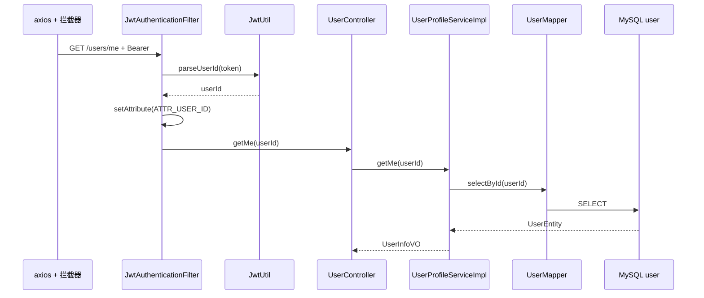

# JWT 过滤器与「当前用户」（GET /users/me）

**Redis / Kafka**：未使用。数据：**MySQL `user`**。

## 受保护路径与 Filter

`JwtAuthenticationFilter.shouldNotFilter`：**仅当** URI **不是**以下前缀时跳过鉴权：

- `/api/v1/users/`
- `/api/v1/cart/`
- `/api/v1/merchant-drafts/`
- `/api/v1/merchant-seckill-coupons/`
- `/api/v1/orders`

对上述路径：

1. `doFilterInternal` 读取 `Authorization: Bearer <token>`。
2. `JwtUtil.parseUserId(token)` → `Long userId`。
3. `request.setAttribute(AuthConstants.ATTR_USER_ID, userId)`。
4. 后续 Controller 方法使用 `@RequestAttribute(ATTR_USER_ID) Long userId`。

**OPTIONS** 预检直接放行。

---

## GET /api/v1/users/me

### 前端

| 步骤 | 位置 | 函数 |
|------|------|------|
| 拉取资料 | 任意需刷新用户处 | `meApi()` |
| HTTP | `frontend/src/api/auth.ts` | `request.get('/users/me')` |
| Axios | `request.ts` 拦截器 | 自动附加 `Authorization: Bearer ${store.token}` |

### 后端

| 步骤 | 类 | 方法 |
|------|-----|------|
| Filter | `JwtAuthenticationFilter` | 解析 JWT → `ATTR_USER_ID` |
| 入口 | `com.food.delivery.controller.user.UserController` | `getMe(@RequestAttribute userId)` |
| 业务 | `com.food.delivery.impl.user.UserProfileServiceImpl` | `getMe(userId)` |
| 读库 | `UserMapper` | `selectById(userId)` → 组装 `UserInfoVO` |

### MySQL

- `UserMapper.selectById` → 表 `user`。

---

## Mermaid

