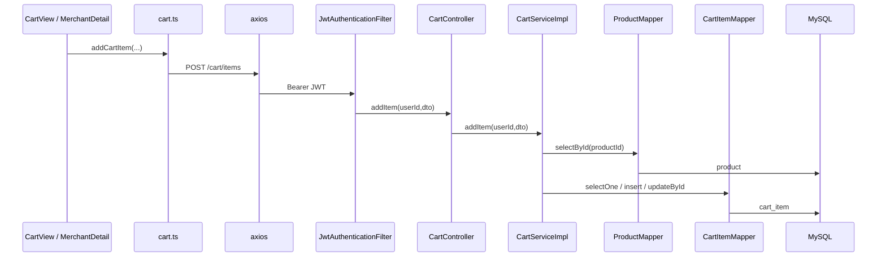

# 购物车：加入商品、改数量、删除、列表

**Redis / Kafka**：未使用。  
**MySQL**：`cart_item`、`product`、`merchant`（列表组装时）。

## 鉴权

`POST/GET/DELETE` `/api/v1/cart/**` → `JwtAuthenticationFilter` → `ATTR_USER_ID`。

## 典型：加入购物车 POST /cart/items

### 前端

| 步骤 | 位置 | 说明 |
|------|------|------|
| 页面 | `CartView.vue` / 商家页加购 | 调用 `addCartItem` 等（`frontend/src/api/cart.ts`） |
| API | `cart.ts` | `request.post('/cart/items', { productId, quantity })` |

### 后端

| 步骤 | 类 | 方法 |
|------|-----|------|
| 入口 | `CartController` | `addItem(userId, AddCartItemDTO)` |
| 业务 | `CartServiceImpl` | `addItem(userId, dto)` `@Transactional` |
| 校验商品 | `ProductMapper` | `selectById(productId)`，校验 `status==1`、库存 |
| 购物车行 | `CartItemMapper` | `selectOne(eq userId + productId)`；无则 `insert`，有则 `updateById`（含 status 复活为 1） |

### MySQL

- `product`：`selectById`
- `cart_item`：`selectOne` / `insert` / `updateById`

---

## GET /cart/items（列表）

- `CartController.listItems` → `CartServiceImpl.listItems(userId)`  
- 内部：`CartItemMapper` 查用户有效行 + `ProductMapper` / `MerchantMapper` 组装 `CartItemVO`（见实现类后半部分 `listItems`）。

---

## 数量 +1 / −1、删除、清空

| HTTP | Controller | CartServiceImpl 方法 |
|------|------------|----------------------|
| POST `.../increase` | `increaseItem` | `increaseItem` → 内部转 `addItem` |
| POST `.../decrease` | `decreaseItem` | `decreaseItem`（`CartItemMapper` 更新数量或 status=0） |
| DELETE `.../items/{productId}` | `removeItem` | `removeItem` |
| DELETE `/clear` | `clearAll` | `clearAll` |

---

## Mermaid（加入购物车）

