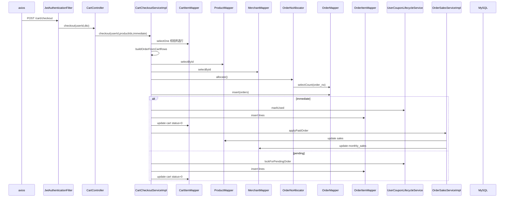

# 购物车：结算预览与多店下单

**Redis / Kafka**：未使用。  
**MySQL**：`cart_item`、`product`、`merchant`、`orders`、`order_item`；订单号 `OrderNoAllocator` 查 `orders` 防重。

## POST /cart/checkout-preview

### 前端

- `frontend/src/api/cart.ts` → `checkoutCartPreview(productIds)` → `POST /cart/checkout-preview`。

### 后端

| 类 | 方法 |
|-----|------|
| `CartController` | `checkoutPreview(userId, CartCheckoutProductIdsDTO)` |
| `CartCheckoutServiceImpl` | `preview(userId, productIds)` |
| 内部 | `groupSelectedCartRows` → 每行 `CartItemMapper.selectOne`；`buildMerchantPreviewVo` → `MerchantMapper.selectById`、`ProductMapper.selectById` |
| 优惠 | `DraftCouponSupport.applyToDraftVo`（读用户券等，内部继续用 `UserCouponMapper` 等） |

**不写订单**，只计算展示 VO。

---

## POST /cart/checkout

### 前端

- `checkoutCart(...)` → `POST /cart/checkout`，body 含 `productIds` 与 `immediate`。

### 后端

| 类 | 方法 |
|-----|------|
| `CartController` | `checkout(userId, CartCheckoutApplyDTO)` |
| `CartCheckoutServiceImpl` | `checkout(userId, productIds, immediate)` `@Transactional` |
| 按店拆分 | `placeOrderForMerchant`（每个 merchant 一单） |
| 建单 | `OrderNoAllocator.allocate()` → `OrderMapper.insert` |
| 券 | `draftCouponSupport.resolveForCheckout`；即时成功 `userCouponLifecycleService.markUsed`，待支付 `lockForPendingOrder` |
| 明细 | `persistOrderLinesAndClearCart` → `OrderItemMapper.insert`；`CartItemMapper.updateById`（行 status=0） |
| 销量（仅 immediate=true 已支付） | `orderSalesService.applyPaidOrder(orderId)` → `ProductMapper.update` sales、`MerchantMapper.update` monthly_sales |

### MySQL 表

- `cart_item`、`product`、`merchant`、`orders`、`order_item`  
- 券相关：`user_coupon` 等（经 `UserCouponLifecycleService`）

---

## Mermaid（下单，单店循环之一）

