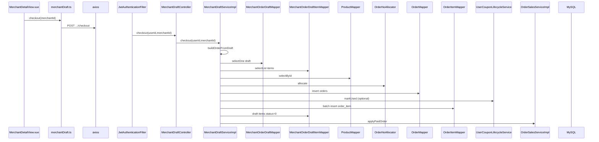

# 待下单草稿：加菜、拉取、结算（成功 / 待支付）

**Redis / Kafka**：未使用。  
**MySQL**：`merchant_order_draft`、`merchant_order_draft_item`、`product`、`merchant`、`orders`、`order_item`；订单号 `OrderNoAllocator`。

## 鉴权

`/api/v1/merchant-drafts/**` → JWT Filter。

## POST /merchant-drafts/items（加菜）

| 层 | 类 | 方法 |
|----|-----|------|
| Controller | `MerchantDraftController` | `addItem(userId, AddCartItemDTO)` |
| Service | `MerchantDraftServiceImpl` | `addItem` `@Transactional` |
| 商品 | `ProductMapper` | `selectById` |
| 草稿头 | `getOrCreateDraft` | `MerchantOrderDraftMapper` `selectOne` / `insert` |
| 草稿行 | `MerchantOrderDraftItemMapper` | `selectOne` / `insert` / `updateById` |

---

## GET /merchant-drafts/merchants/{merchantId}

- `MerchantDraftController.getDraft` → `MerchantDraftServiceImpl.getDraft`  
- `MerchantOrderDraftMapper`、`MerchantOrderDraftItemMapper`、`ProductMapper`、`MerchantMapper`  
- `DraftCouponSupport.applyToDraftVo` 计算可用券展示。

---

## POST .../checkout（直接成功）

| 步骤 | 方法 |
|------|------|
| `MerchantDraftServiceImpl` | `checkout(userId, merchantId)` `@Transactional` |
| 组单 | `buildOrderFromDraft`（内部大量 `draftItemMapper` / `productMapper` / `merchantMapper`） |
| 券 | `draftCouponSupport.resolveForCheckout` |
| 订单号 | `orderNoAllocator.allocate()` |
| 写订单 | `orderMapper.insert`，`status = PAID_SUCCESS` |
| 券核销 | `userCouponLifecycleService.markUsed` |
| 明细与清草稿 | `persistOrderLinesAndClearDraft` → `orderItemMapper.insert`，`draftItemMapper.updateById` status=0 |
| 销量 | `orderSalesService.applyPaidOrder` |

---

## POST .../checkout-pending（待支付）

- `checkoutPending`：订单 `status = PENDING_PAYMENT`，`expire_at = now + 30min`；  
  `userCouponLifecycleService.lockForPendingOrder(userCouponId, orderId)`；  
  **不调用** `orderSalesService.applyPaidOrder`（支付成功后再计销量）。

---

## Mermaid（checkout 直接成功）

