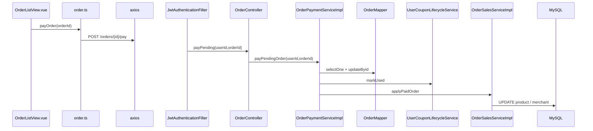

# 订单：列表、待支付付款、取消

**Redis / Kafka**：未使用。  
**MySQL**：`orders`、`order_item`、`merchant`；支付/取消涉及 `user_coupon`（经 `UserCouponLifecycleService`）。

## GET /api/v1/orders

| 层 | 类 | 方法 |
|----|-----|------|
| Filter | `JwtAuthenticationFilter` | JWT |
| Controller | `OrderController` | `listOrders(userId)` |
| Service | `OrderQueryServiceImpl` | `listOrders(userId)` |
| Mapper | `OrderMapper` | `selectList(eq userId, orderByDesc createdAt)` |
| | `OrderItemMapper` | `selectList(in orderId)` |
| | `MerchantMapper` | `selectBatchIds` 补店名 |

---

## POST /orders/{orderId}/pay

| 层 | 类 | 方法 |
|----|-----|------|
| Controller | `OrderController` | `payPending(userId, orderId)` |
| Service | `OrderPaymentServiceImpl` | `payPendingOrder` `@Transactional` |
| | `OrderMapper` | `selectOne` 校验用户+待支付+未过期 |
| | `OrderMapper` | `updateById` → `status=PAID_SUCCESS`，`expireAt=null` |
| | `UserCouponLifecycleService` | `markUsed(userCouponId)` |
| | `OrderSalesServiceImpl` | `applyPaidOrder(orderId)` → 更新 `product.sales`、`merchant.monthly_sales` |

---

## POST /orders/{orderId}/cancel

| 层 | 类 | 方法 |
|----|-----|------|
| Service | `OrderPaymentServiceImpl` | `cancelPendingOrder` `@Transactional` |
| | `UserCouponLifecycleService` | `releaseByOrderId(orderId)` |
| | `OrderMapper` | `updateById` → `status=CANCELLED` |

---

## Mermaid（支付）

