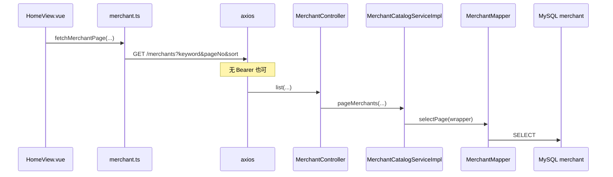

# 商家目录（公开接口，无 JWT）

**Redis / Kafka**：未使用。  
**MySQL**：`merchant`、`product_category`、`product`；评价读 `merchant_review` 及相关表。

以下路径 **不进入** `JwtAuthenticationFilter` 强制 Bearer（`shouldNotFilter` 为 true）：`/api/v1/merchants` 等。

## GET /api/v1/merchants（分页列表）

| 层 | 类 | 方法 |
|----|-----|------|
| Controller | `MerchantController` | `list(keyword, pageNo, pageSize, sort)` |
| Service | `MerchantCatalogServiceImpl` | `pageMerchants(...)` |
| Mapper | `MerchantMapper` | `selectPage` + `LambdaQueryWrapper`（`status=1`，keyword `like name`，`applyMerchantSort`） |

### 前端

- `frontend/src/views/home/HomeView.vue` 拉列表 → `frontend/src/api/merchant.ts` `fetchMerchantPage`。

---

## GET /merchants/{id}

- `MerchantController.detail` → `MerchantCatalogServiceImpl.getMerchant` → `MerchantMapper.selectById` + `requireOpenMerchant`。

---

## GET /merchants/{id}/categories

- `listCategories` → `ProductCategoryMapper.selectList(eq merchantId)`。

---

## GET /merchants/{id}/products

- `listProducts` → `ProductMapper` 按商家（及可选 `categoryId`）查询上架商品。

---

## GET /merchants/{id}/seckill-coupons

- `MerchantController.seckillCoupons` → `MerchantSeckillCouponServiceImpl.listSeckillCoupons` → `MerchantSeckillCouponMapper.selectList`（时间窗、库存、上架状态）。

---

## GET /merchants/{id}/reviews

- `MerchantController.reviews` → `MerchantReviewServiceImpl.pageReviews` → `MerchantReviewMapper.selectPage`，并批量 `MerchantReviewImageMapper`、`MerchantReviewRecommendMapper`、`UserMapper`、`ProductMapper` 组装 VO。

---

## Mermaid（首页商家分页）

