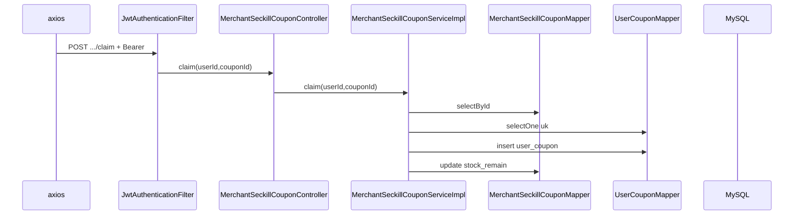

# 秒杀券：抢券

**Redis / Kafka**：未使用（**无**分布式锁，并发下依赖 DB 事务与唯一约束）。  
**MySQL**：`merchant_seckill_coupon`、`user_coupon`。

## POST /api/v1/merchant-seckill-coupons/{couponId}/claim

### 鉴权

路径前缀 `/api/v1/merchant-seckill-coupons/` → **需要** JWT Filter。

### 前端

- `frontend/src/api/userCoupon.ts`（或商家页内联调用）→ `POST .../merchant-seckill-coupons/{id}/claim`。

### 后端

| 层 | 类 | 方法 |
|----|-----|------|
| Controller | `MerchantSeckillCouponController` | `claim(userId, couponId)` |
| Service | `MerchantSeckillCouponServiceImpl` | `claim(userId, couponId)` `@Transactional` |
| 读模板 | `MerchantSeckillCouponMapper` | `selectById` |
| 校验 | 同上 | 有效期、`stock_remain` |
| 防重领 | `UserCouponMapper` | `selectOne(eq userId + seckill_coupon_id)` |
| 写用户券 | `UserCouponMapper` | `insert` |
| 扣库存 | `MerchantSeckillCouponMapper` | `update`（`LambdaUpdateWrapper` 扣 `stock_remain`） |

### MySQL

- `merchant_seckill_coupon`：读 + 条件更新库存  
- `user_coupon`：插入；唯一键 `(user_id, seckill_coupon_id)` 防重复

---

## Mermaid

---

## 附录：我的优惠券 GET /users/me/coupons

| 类 | 方法 |
|-----|------|
| `UserMeCouponController` | `listCoupons(userId)` |
| `UserCouponQueryServiceImpl` | `listMine(userId)` → `UserCouponMapper` 等 |

## 附录：已抢秒杀券 id GET /users/me/claimed-seckill-ids

| 类 | 方法 |
|-----|------|
| `UserMeCouponController` | `claimedSeckillIds(userId, merchantId)` |
| `UserCouponQueryServiceImpl` | `listClaimedSeckillCouponIds(userId, merchantId)` |

**MySQL**：`user_coupon`（及关联查询模板/商家，见实现类）。
