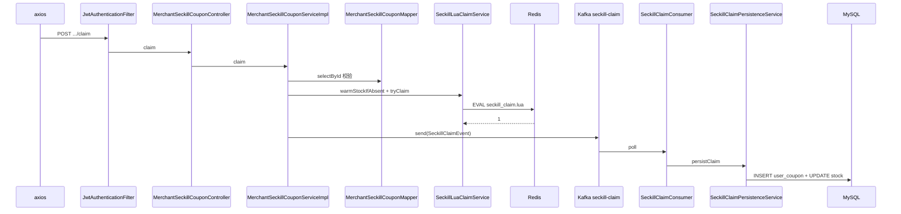

# 秒杀券：抢券（Redis + Lua + 可选 Kafka）

**MySQL**：`merchant_seckill_coupon`、`user_coupon`（最终一致落库）。  
**Redis**：`StringRedisTemplate` + 脚本 `scripts/seckill_claim.lua`，键见 `SeckillRedisKeys`。  
**Kafka**（`app.seckill.kafka-enabled=true`）：主题 `app.seckill.kafka-topic`（默认 `seckill-claim`），消费者 `SeckillClaimConsumer`。

## 配置开关（`app.seckill`）

| 配置项 | 说明 |
|--------|------|
| `redis-lua-enabled` | `true`（默认）：先走 Redis+Lua 闸门；`false`：退回 `SeckillDbOnlyClaimService` 纯 DB 事务（无 Redis 环境）。 |
| `kafka-enabled` | `true`：Lua 成功后发 Kafka，由 `SeckillClaimPersistenceService` 在消费端落库；`false`：Lua 成功后**同步**调用 `persistClaim`。 |
| `kafka-topic` | 生产者/消费者 topic 名（默认 `seckill-claim`）。 |

根 `application.yml` 当前为 `kafka-enabled: true`；本地无 Kafka 时在对应 profile 或根配置改为 `false` 即可同步落库、无需 Broker。

## Kafka Topic（业务 vs 内部）

- **业务 topic**：名称为 `app.seckill.kafka-topic`，与生产者 `send`、消费者 `@KafkaListener` 一致。
- **启动时创建**：仅当 `kafka-enabled=true` 时加载 **`SeckillKafkaTopicConfiguration`**，注册 **`NewTopic`**，由 **`KafkaAdmin`** 在上下文初始化阶段向 broker 创建该 topic（默认 **3 分区、1 副本**）。若启动时连不上 Kafka，可能**建 topic 失败**（见日志），与「列表里看不到 `seckill-claim`」现象相关。
- **`__consumer_offsets`**：Kafka 为 consumer group 自动使用的**内部 topic**，非本应用配置项；有消费者组消费时即会出现，属正常现象。

## Lua 语义（防超卖 + 一人一单）

脚本路径：`backend/src/main/resources/scripts/seckill_claim.lua`。

- `KEYS[1]`：`seckill:stock:{couponId}`（字符串整数库存）
- `KEYS[2]`：`seckill:claimed:{couponId}`（已成功抢到的 `userId` 集合）
- 在**同一段 Lua** 内顺序：`SISMEMBER` 判重 → `GET` 库存 `<=0` 则返回售罄 → `DECR` → `SADD`（若 `SADD==0` 则 `INCR` 回滚库存并返回已领）。  
- 返回值：`1` 成功，`0` 售罄，`2` 已领，`-1` 库存 key 不存在（应用层 `warmStockIfAbsent` 后重试）

## POST /api/v1/merchant-seckill-coupons/{couponId}/claim

### 鉴权

`JwtAuthenticationFilter` → `MerchantSeckillCouponController.claim`。

### 前端

- `frontend/src/api/userCoupon.ts` → `POST .../merchant-seckill-coupons/{id}/claim`。

### 后端主路径（`redis-lua-enabled=true`）

| 步骤 | 类 | 方法 |
|------|-----|------|
| 入口 | `MerchantSeckillCouponController` | `claim` |
| 编排 | `MerchantSeckillCouponServiceImpl` | `claim` |
| 读模板校验 | `MerchantSeckillCouponMapper` | `selectById`；校验状态、时间窗、DB 上 `stock_remain>0`（首道闸） |
| 预热库存 key | `SeckillLuaClaimService` | `warmStockIfAbsent(couponId, stockRemain)` |
| 原子闸门 | `SeckillLuaClaimService` | `tryClaim(userId, couponId)` → `execute(claimScript)` |
| Kafka 发送失败回滚 | `SeckillLuaClaimService` | `rollbackRedisClaim`（`INCR` + `SREM`） |
| 同步落库 | `SeckillClaimPersistenceService` | `persistClaim(SeckillClaimEvent)`（`kafka-enabled=false` 时由请求线程调用） |
| 异步落库 | `KafkaTemplate` bean `seckillKafkaTemplate` | `send(topic, couponIdKey, event).get(timeout)` |
| 消费 | `SeckillClaimConsumer` | `onClaim` → `persistClaim` |

### `SeckillClaimPersistenceService.persistClaim`（幂等）

1. 若已存在 `(user_id, seckill_coupon_id)` 则返回。  
2. `insert user_coupon`；捕获 `DataIntegrityViolationException` 视为重复消息。  
3. 条件 `UPDATE merchant_seckill_coupon SET stock_remain = stock_remain - 1 WHERE ... AND stock_remain>0`；若为 0 行则抛异常**回滚 insert**（避免 Redis 与 DB 严重不一致时脏数据）。

### 纯 DB 降级（`redis-lua-enabled=false`）

- `SeckillDbOnlyClaimService.claim`：与旧实现一致，单事务内先查重、乐观扣库存、`insert`。

---

## Mermaid（Redis + Kafka 开启时）

---

## 附录：我的优惠券 / 已抢 id

（与此前一致，见下文。）

| 接口 | Controller | Service |
|------|------------|---------|
| GET `/users/me/coupons` | `UserMeCouponController.listCoupons` | `UserCouponQueryServiceImpl.listMine` |
| GET `/users/me/claimed-seckill-ids` | `UserMeCouponController.claimedSeckillIds` | `UserCouponQueryServiceImpl.listClaimedSeckillCouponIds` |

## 运维提示

- 使用 Kafka 路径时：优先依赖 **`KafkaAdmin` + `NewTopic`** 自动建 `seckill-claim`；若关闭自动创建或权限不足，需在 broker 上手动建同名 topic，或开启 broker **`auto.create.topics.enable`**（视环境策略而定）。
- **演示券数据**：Flyway **V18** 为每个上架商家追加 4 条秒杀券模板，便于联调；重测前若 Redis 与 DB 不一致，可清空 `seckill:stock:*` / `seckill:claimed:*` 后按 DB `stock_remain` 预热。
- Redis 与 DB 库存可能短暂不一致，活动结束建议**对账**。
