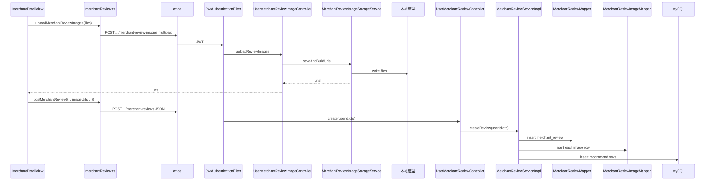

# 评价：上传配图、发表评价、列表

**Redis / Kafka**：未使用。  
**MySQL**：`merchant_review`、`merchant_review_image`、`merchant_review_recommend`、`merchant`、`product`、`user`。  
**本地文件**：评价图先上传再提交 URL（见下文）。

## A. 上传评价配图 POST /users/me/merchant-review-images

### 鉴权

JWT + `multipart/form-data`。

### 后端

| 类 | 方法 |
|-----|------|
| `UserMerchantReviewImageController` | `uploadReviewImages(userId, files, request)` |
| `MerchantReviewImageStorageService` | `saveAndBuildUrls(files, request)` → 写磁盘，返回可访问 URL 列表 |

### 存储

- **本地磁盘** + **HTTP GET** `ReviewImageFileController` `/api/v1/files/review-images/{filename}`  
- **不写 DB**（仅返回 URL 字符串给前端）。

---

## B. 发表评价 POST /users/me/merchant-reviews

### 前端

- `merchantReview.ts` → `postMerchantReview(payload)`（含 `imageUrls`、`recommendProductIds` 等）。

### 后端

| 类 | 方法 |
|-----|------|
| `UserMerchantReviewController` | `create(userId, MerchantReviewCreateDTO)` |
| `MerchantReviewServiceImpl` | `createReview(userId, dto)` `@Transactional` |
| 校验 | `requireOpenMerchant`、`productMapper.selectById` 校验推荐菜属于该店 |
| 写评价 | `MerchantReviewMapper.insert` |
| 写图 URL | `MerchantReviewImageMapper.insert`（每条 URL 一行） |
| 写推荐菜 | `MerchantReviewRecommendMapper.insert` |

---

## C. 店铺评价分页 GET /merchants/{id}/reviews

- `MerchantController.reviews` → `MerchantReviewServiceImpl.pageReviews` → `MerchantReviewMapper.selectPage` + 批量补图/推荐菜/用户展示名。

---

## D. 我的评价 GET /users/me/reviews

- `UserMerchantReviewController.listMyReviews` → `MerchantReviewServiceImpl.pageReviewsByUser`。

---

## Mermaid（发表评价，含先传图）

