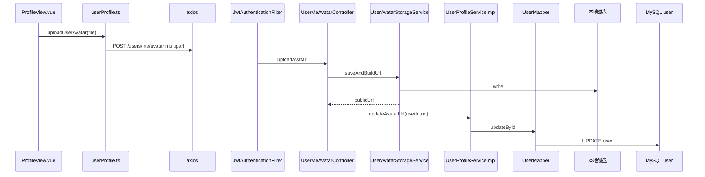

# 用户头像上传

**Redis / Kafka**：未使用。  
**MySQL**：`user.avatar_url`。  
**本地文件**：头像二进制落盘，通过静态 URL 访问。

## POST /api/v1/users/me/avatar

### 前端

- `frontend/src/api/userProfile.ts` → `uploadUserAvatar(file)` → `FormData` + `POST /users/me/avatar`。

### 后端

| 类 | 方法 |
|-----|------|
| `UserMeAvatarController` | `uploadAvatar(userId, file, request)` |
| `UserAvatarStorageService` | `saveAndBuildUrl(file, request)` → 保存文件，拼出对外 URL |
| `UserProfileServiceImpl` | `updateAvatarUrl(userId, url)` → `UserMapper.selectById` + `updateById` |

### 读取文件

- `UserAvatarFileController`：`GET /api/v1/files/user-avatars/{filename}`（**无 JWT**）。

---

## Mermaid

