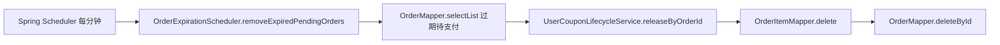

# 后台定时任务（非用户请求路径）

**Redis / Kafka**：未使用。  
以下为 Spring `@Scheduled`，**不经过** 浏览器 / Controller。

## OrderExpirationScheduler.removeExpiredPendingOrders

| 项 | 内容 |
|----|------|
| 类 | `com.food.delivery.schedule.OrderExpirationScheduler` |
| 周期 | `@Scheduled(fixedRate = 60_000)`（每分钟） |
| 逻辑 | `OrderMapper.selectList`：`status = PENDING_PAYMENT` 且 `expireAt < now` |
| 清理 | 对每个过期单：`UserCouponLifecycleService.releaseByOrderId` → `OrderItemMapper.delete` → `OrderMapper.deleteById` |

### MySQL

- `orders`、`order_item`（删除）；`user_coupon` 状态由 `UserCouponLifecycleService` 更新。

---

## UserCouponExpiredPurgeScheduler

| 项 | 内容 |
|----|------|
| 类 | `com.food.delivery.schedule.UserCouponExpiredPurgeScheduler` |
| 周期 | `@Scheduled(fixedRate = 60_000)` |
| 方法 | `purgeExpiredUnused()` |
| 逻辑 | `UserCouponMapper.delete`：`expireAt < now` 且 `status = UNUSED` 且 `locked_order_id IS NULL` |

---

## Mermaid（过期待支付订单）

